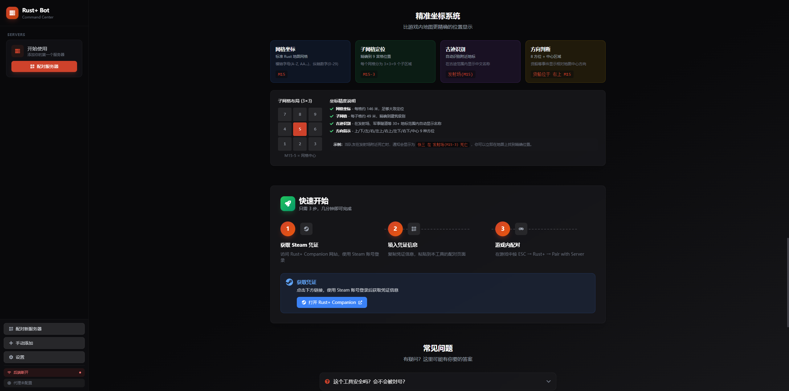
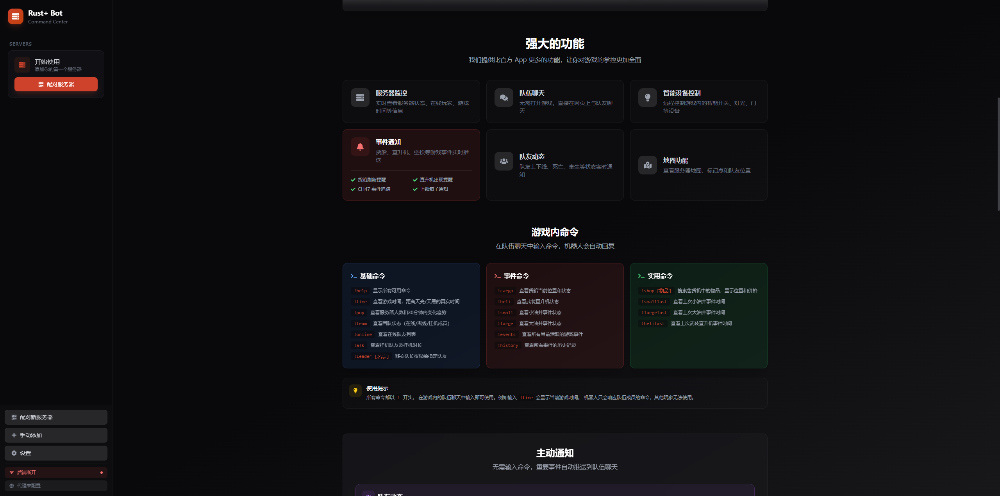
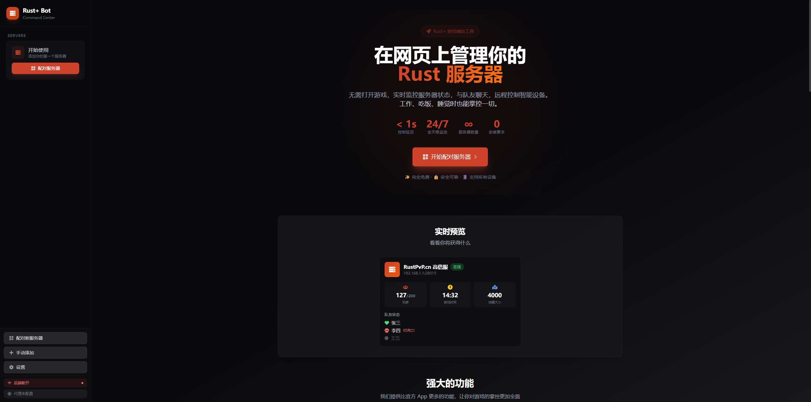

<p align="center">
  
</p>

<h1 align="center">Rust+ Web Dashboard</h1>

<p align="center">
  一个基于 Web 的 Rust+ 游戏助手，无需打开游戏即可监控服务器、与队友聊天、控制智能设备。
</p>

<p align="center">
  
  
  
  
</p>

<p align="center">
  <a href="#-快速开始">快速开始</a> •
  <a href="#-功能特性">功能特性</a> •
  <a href="#-游戏内命令">游戏内命令</a> •
  <a href="#-智能设备自动化">设备自动化</a> •
  <a href="#-常见问题">常见问题</a>
</p>

---

## 目录

- [功能特性](#-功能特性)
- [系统架构](#-系统架构)
- [快速开始](#-快速开始)
  - [Docker 部署](#docker-部署推荐)
  - [本地部署](#本地部署)
- [首次使用](#-首次使用)
- [游戏内命令](#-游戏内命令)
- [智能设备自动化](#-智能设备自动化)
- [通知设置](#-通知设置)
- [自动通知](#-自动通知)
- [环境变量](#-环境变量)
- [API 参考](#-api-参考)
- [代理配置](#-代理配置中国大陆)
- [常见问题](#-常见问题)
- [相关文档](#-相关文档)
- [致谢](#-致谢)
- [许可证](#-许可证)

---

## 📸 界面预览

<!-- 请替换为实际截图 -->
<p align="center">
  
</p>

<details>
<summary>查看更多截图</summary>

| 服务器信息 | 队伍聊天 | 设备控制 |
|:---:|:---:|:---:|
|  |  |  |

</details>

---

## ✨ 功能特性

### 🎮 核心功能
| 功能 | 说明 |
|------|------|
| **服务器监控** | 实时查看服务器状态、在线玩家、游戏时间 |
| **队伍聊天** | 从网页发送消息到游戏内队伍聊天 |
| **智能设备控制** | 远程控制游戏内的门、灯、开关等设备 |
| **PTZ 摄像头** | 支持 CCTV 摄像头订阅、方向控制、拍照 |

### 📡 事件监控
| 功能 | 说明 |
|------|------|
| **游戏事件追踪** | 货船、直升机、CH47、油井等事件实时提醒 |
| **队友动态** | 自动通知队友上下线（含在线时长）、死亡、挂机状态 |
| **袭击检测** | 检测爆炸声并发出警报 |
| **精准定位** | 子网格坐标(M15-3)、古迹自动识别(发射场) |

### ⚡ 自动化系统
| 功能 | 说明 |
|------|------|
| **设备自动化** | 按日夜、在线状态自动开关设备 |
| **自定义命令** | 为设备绑定 `!` 命令快速控制 |
| **通知设置** | 可单独开关各类事件通知 |

### 🔧 扩展功能
| 功能 | 说明 |
|------|------|
| **售货机搜索** | 搜索地图上所有售货机的物品 |
| **翻译功能** | 游戏内消息翻译 |
| **代理支持** | 内置 xray 代理，解决中国大陆连接问题 |
| **Battlemetrics** | 查看服务器详细信息和玩家排名 |

---

## 🏗 系统架构

```
┌─────────────────────────────────────────────────────────────────┐
│                        浏览器客户端                              │
│                    (React + Vite + Tailwind)                    │
└───────────────────┬─────────────────────┬───────────────────────┘
                    │                     │
             REST API (Axios)      WebSocket (Socket.io)
                    │                     │
┌───────────────────┴─────────────────────┴───────────────────────┐
│                 后端服务 (Express + Node.js)                     │
│  ┌────────────────────────────────────────────────────────────┐ │
│  │                    WebSocket 服务层                         │ │
│  │              (实时事件广播给所有客户端)                      │ │
│  └────────────────────────────┬───────────────────────────────┘ │
│                               │                                  │
│  ┌────────────────────────────┼───────────────────────────────┐ │
│  │                        核心服务                             │ │
│  │  ┌──────────────┐ ┌──────────────┐ ┌──────────────────┐   │ │
│  │  │ RustPlus    │ │ FCMService   │ │ AutomationService│   │ │
│  │  │ Service     │ │ (推送监听)   │ │ (设备自动化)     │   │ │
│  │  │ (连接池)    │ │              │ │                  │   │ │
│  │  └──────────────┘ └──────────────┘ └──────────────────┘   │ │
│  │  ┌──────────────┐ ┌──────────────┐ ┌──────────────────┐   │ │
│  │  │ Commands    │ │ EventMonitor │ │ ProxyService     │   │ │
│  │  │ Service     │ │ Service      │ │ (xray 代理)      │   │ │
│  │  │ (命令处理)  │ │ (事件追踪)   │ │                  │   │ │
│  │  └──────────────┘ └──────────────┘ └──────────────────┘   │ │
│  └────────────────────────────────────────────────────────────┘ │
│                               │                                  │
│  ┌────────────────────────────┴───────────────────────────────┐ │
│  │                      数据层 (SQLite)                        │ │
│  │   servers │ devices │ event_logs │ fcm_credentials         │ │
│  └────────────────────────────────────────────────────────────┘ │
└─────────────────────────────────────────────────────────────────┘
                               │
                               ▼
┌─────────────────────────────────────────────────────────────────┐
│                      外部服务                                    │
│  ┌──────────────┐ ┌──────────────┐ ┌──────────────────────────┐ │
│  │ Rust+ API   │ │ FCM/GCM      │ │ Battlemetrics API        │ │
│  │ (游戏服务器) │ │ (推送服务)   │ │ (服务器统计)             │ │
│  └──────────────┘ └──────────────┘ └──────────────────────────┘ │
└─────────────────────────────────────────────────────────────────┘
```

---

## 🚀 快速开始

### Docker 部署（推荐）

**前置要求：** Docker >= 20.10, Docker Compose >= 2.0

```bash
# 一键启动
./docker-start.sh

# 或手动启动
docker-compose up -d

# 查看日志
docker-compose logs -f

# 停止服务
docker-compose down
```

**访问地址：**
| 服务 | 地址 |
|------|------|
| 前端 | http://localhost:3002 |
| 后端 API | http://localhost:3001/api |
| 健康检查 | http://localhost:3001/api/health |

> 修改端口：编辑 `.env` 文件中的 `BACKEND_PORT` 和 `FRONTEND_PORT`

详细说明见 [Docker 部署指南](DOCKER.md)

---

### 本地部署

**前置要求：** Node.js >= 18

```bash
# 1. 克隆项目
git clone https://github.com/your-repo/rust-bot.git
cd rust-bot

# 2. 安装后端依赖
cd backend && npm install

# 3. 安装前端依赖
cd ../frontend && npm install

# 4. 启动后端（终端1）
cd backend && npm run dev

# 5. 启动前端（终端2）
cd frontend && npm run dev
```

**访问地址：**
| 服务 | 地址 |
|------|------|
| 前端 | http://localhost:5173 |
| 后端 API | http://localhost:3000/api |

---

## 📖 首次使用

### 第一步：获取凭证

1. 打开网页后，点击「开始配对」
2. 点击「自动注册」，会打开 Steam 登录页面
3. 使用 Steam 账号登录
4. 登录成功后，页面会显示凭证命令：
   ```
   /credentials add gcm_android_id:xxx gcm_security_token:xxx steam_id:xxx ...
   ```
5. 复制完整命令，粘贴到输入框
6. 点击「完成注册」，等待连接建立

### 第二步：配对服务器

1. 确保网页显示「FCM 已连接」（绿色状态）
2. 进入 Rust 游戏，加入服务器
3. 按 `ESC` → 点击右下角 `Rust+` 图标 → 点击「Pair with Server」
4. 网页会自动显示配对成功通知
5. 服务器出现在列表中，点击即可连接

### 第三步：配对设备（可选）

1. 在游戏中靠近智能设备（开关、灯等）
2. 按住 `E` → 选择「Pair」
3. 设备会自动出现在网页的设备列表中

---

## 🎯 游戏内命令

连接服务器后，在游戏内队伍聊天中输入命令即可使用。

### 📌 基础命令

| 命令 | 说明 | 示例 |
|------|------|------|
| `!help` | 显示所有可用命令 | `!help` |
| `!time` | 查看游戏时间和日夜倒计时 | `!time` → `🌙 01:30 - 还有 12分钟 天亮` |
| `!pop` | 查看服务器人数和趋势 | `!pop` → `👥 85/100 (+5)` |

### 👥 队伍命令

| 命令 | 说明 | 示例 |
|------|------|------|
| `!team` | 显示队伍统计 | `!team` → `在线 3 / 离线 2 / 挂机 1` |
| `!online` | 显示在线队友列表 | `!online` |
| `!afk` | 显示挂机队友及时长 | `!afk` → `张三 (5分钟)` |
| `!leader [名字]` | 移交队长权限 | `!leader 张三` |

### 🎪 事件命令

| 命令 | 说明 | 示例 |
|------|------|------|
| `!cargo` | 查看货船位置和剩余时间 | `!cargo` → `🚢 M15 - 剩余 23分钟` |
| `!heli` | 查看武装直升机位置 | `!heli` → `🚁 K12 往东飞行` |
| `!small` | 查看小油井状态 | `!small` → `已触发 - 箱子 8分钟后解锁` |
| `!large` | 查看大油井状态 | `!large` |
| `!events` | 查看所有活跃事件 | `!events` |
| `!history` | 查看事件历史记录 | `!history` |

### 🛠 实用命令

| 命令 | 说明 | 示例 |
|------|------|------|
| `!shop [物品]` | 搜索售货机物品 | `!shop ak` → `AK47 @ M15 - 300 硫磺` |
| `!tr <语言> <文字>` | 翻译到指定语言 | `!tr en 你好` → `Hello` |
| `!trf <源> <目标> <文字>` | 指定源语言翻译 | `!trf zh en 你好` → `Hello` |
| `!smalllast` | 上次小油井触发时间 | `!smalllast` → `15分钟前` |
| `!largelast` | 上次大油井触发时间 | `!largelast` |
| `!helilast` | 上次直升机事件时间 | `!helilast` |

### 🔌 设备命令

为设备绑定自定义命令后，可通过命令快速控制：

| 命令 | 说明 |
|------|------|
| `!灯` | 切换名为"灯"的设备状态 |
| `!门 on` | 打开名为"门"的设备 |
| `!门 off` | 关闭名为"门"的设备 |
| `!门 status` | 查看设备当前状态 |
| `!灯 on 5m` | 开启5分钟后自动关闭 |
| `!灯 off 30s` | 关闭30秒后自动开启 |

> 时间格式支持：`30s`（秒）、`5m`（分钟）、`1h`（小时）

> 完整说明见 [命令指南](docs/COMMANDS_GUIDE.md)

---

## ⚡ 智能设备自动化

在网页的设备控制面板中，可以为每个设备设置自动化模式：

| 模式 | 代码 | 说明 |
|------|:----:|------|
| 🔧 **手动** | `0` | 不自动控制，仅手动操作 |
| ☀️ **白天开启** | `1` | 游戏白天自动开启，夜晚关闭 |
| 🌙 **夜晚开启** | `2` | 游戏夜晚自动开启，白天关闭 |
| ✅ **始终开启** | `3` | 保持开启状态 |
| ❌ **始终关闭** | `4` | 保持关闭状态 |
| 👥 **在线开启** | `7` | 有队友在线时开启 |
| 💤 **离线开启** | `8` | 所有队友离线时开启 |

**设置方法：**
1. 在设备列表中找到设备
2. 点击设备右侧的设置图标
3. 选择自动化模式
4. 可选：绑定自定义命令（如 `灯`、`门`）

**注意事项：**
- 自动化每 30 秒检测一次
- 手动操作后有 5 秒冷却时间，防止循环触发
- 设备不可达时会自动标记，不会尝试控制

---

## 🔔 通知设置

可以在设置面板中单独开关各类通知：

### 游戏事件
| 事件类型 | 默认 | 说明 |
|---------|:----:|------|
| 货船刷新 | ✅ | 货船出现时通知 |
| 货船停靠 | ✅ | 货船停靠港口时通知 |
| 货船辐射 | ✅ | 货船即将离开时通知（5分钟警告） |
| 货船离开 | ❌ | 货船离开地图时通知 |
| 直升机刷新 | ✅ | 直升机出现时通知 |
| 直升机坠落 | ✅ | 直升机被击落时通知 |
| 直升机离开 | ❌ | 直升机离开地图时通知 |
| 油井触发 | ✅ | 油井被触发时通知 |
| 油井警告 | ✅ | 箱子即将解锁时通知 |
| 油井解锁 | ✅ | 箱子解锁时通知 |
| 上锁箱子 | ❌ | 上锁箱子出现时通知 |
| CH47 | ❌ | CH47出现时通知 |
| 袭击检测 | ✅ | 检测到爆炸声时通知 |
| 售货机新货 | ❌ | 售货机上架新物品时通知 |

### 队友动态
| 事件类型 | 默认 | 说明 |
|---------|:----:|------|
| 上线通知 | ✅ | 队友上线时通知（含离线时长） |
| 下线通知 | ✅ | 队友下线时通知（含游玩时长） |
| 死亡通知 | ✅ | 队友死亡时通知（含位置） |
| 挂机提醒 | ✅ | 队友挂机超过3分钟时通知 |

### 昼夜提醒
| 设置项 | 默认 | 说明 |
|--------|:----:|------|
| 启用昼夜提醒 | ✅ | 是否启用日出日落提醒 |
| 天亮提醒 | 5分钟 | 天亮前几分钟开始提醒 |
| 天黑提醒 | 8分钟 | 天黑前几分钟开始提醒 |

---

## 📢 自动通知

机器人会自动在队伍聊天发送以下通知：

### 👥 队友动态
```
张三 在离线 2小时30分钟 后上线了
张三 今天游玩了 3小时 (其中挂机 45分钟)
张三 在 发射场(M15-3) 死亡
张三 已离开 5 分钟 - K12-7
```

### 🎪 游戏事件
```
🚢 货船刷新 @ M15 往东
🚢 货船停靠港口
⚠️ 货船辐射上升 - 5分钟后离开
🚁 直升机刷新 @ K12 往南
🚁 直升机被击落 @ J11-4
⛽ 小油井被触发 - 15分钟后解锁
📦 上锁箱子出现 @ 发射场(L8)
```

### 🚨 安全警报
```
⚠️ 检测到袭击 位置: J11-4 (3次爆炸)
```

---

## ⚙️ 环境变量

### 后端 (`backend/.env`)

| 变量 | 默认值 | 说明 |
|------|--------|------|
| `PORT` | `3000` | HTTP 服务器端口 |
| `FRONTEND_URL` | `http://localhost:5173` | 前端 URL（CORS 白名单） |
| `PROXY_SUBSCRIPTION_URL` | - | 代理订阅地址（可选） |
| `PROXY_NODE_NAME` | - | 默认代理节点名称（可选） |
| `PROXY_PORT` | `10808` | 本地代理端口（可选） |

### 前端 (`frontend/.env`)

| 变量 | 默认值 | 说明 |
|------|--------|------|
| `VITE_API_URL` | `http://localhost:3000/api` | 后端 API 地址 |
| `VITE_SOCKET_URL` | `http://localhost:3000` | WebSocket 地址 |

### Docker (`.env`)

| 变量 | 默认值 | 说明 |
|------|--------|------|
| `BACKEND_PORT` | `3001` | 后端映射端口 |
| `FRONTEND_PORT` | `3002` | 前端映射端口 |

---

## 📡 API 参考

### 服务器管理

| 方法 | 端点 | 说明 |
|------|------|------|
| `GET` | `/api/servers` | 获取所有服务器列表 |
| `GET` | `/api/servers/:id` | 获取单个服务器详情 |
| `POST` | `/api/servers` | 添加新服务器 |
| `PUT` | `/api/servers/:id` | 更新服务器信息 |
| `DELETE` | `/api/servers/:id` | 删除服务器 |

### 设备管理

| 方法 | 端点 | 说明 |
|------|------|------|
| `GET` | `/api/servers/:id/devices` | 获取服务器设备列表 |
| `PUT` | `/api/servers/:id/devices/:entityId` | 更新设备设置 |
| `DELETE` | `/api/servers/:id/devices/:entityId` | 删除设备 |
| `GET` | `/api/servers/:id/devices/:entityId/status` | 获取设备实时状态 |

### 事件日志

| 方法 | 端点 | 说明 |
|------|------|------|
| `GET` | `/api/servers/:id/events` | 获取事件日志（支持 `?limit=100`） |

### FCM 配对

| 方法 | 端点 | 说明 |
|------|------|------|
| `GET` | `/api/pairing/status` | 获取 FCM 连接状态 |
| `POST` | `/api/pairing/credentials/manual` | 提交 GCM 凭证 |
| `POST` | `/api/pairing/stop` | 停止 FCM 监听 |
| `DELETE` | `/api/pairing/credentials` | 清除凭证 |

### 代理管理

| 方法 | 端点 | 说明 |
|------|------|------|
| `GET` | `/api/proxy/status` | 获取代理状态 |
| `POST` | `/api/proxy/config` | 保存代理配置 |
| `POST` | `/api/proxy/start` | 启动代理 |
| `POST` | `/api/proxy/stop` | 停止代理 |
| `GET` | `/api/proxy/nodes` | 获取订阅节点列表 |

### 通知设置

| 方法 | 端点 | 说明 |
|------|------|------|
| `GET` | `/api/settings/notifications` | 获取通知设置 |
| `POST` | `/api/settings/notifications` | 更新通知设置 |
| `POST` | `/api/settings/notifications/reset` | 重置为默认 |

### WebSocket 事件

**客户端 → 服务器：**
| 事件 | 说明 |
|------|------|
| `server:connect` | 连接到游戏服务器 |
| `server:disconnect` | 断开服务器连接 |
| `message:send` | 发送队伍消息 |
| `device:control` | 控制设备开关 |
| `camera:subscribe` | 订阅摄像头 |

**服务器 → 客户端：**
| 事件 | 说明 |
|------|------|
| `server:connected` | 服务器已连接 |
| `server:disconnected` | 服务器已断开 |
| `team:message` | 收到队伍消息 |
| `player:online` | 玩家上线 |
| `player:offline` | 玩家下线 |
| `player:died` | 玩家死亡 |
| `entity:changed` | 设备状态变化 |
| `alarm:triggered` | 警报触发 |

---

## 🌐 代理配置（中国大陆）

如果在中国大陆无法连接 Rust+ 服务器，可以配置代理：

### 方式一：内置代理（推荐）

1. 点击设置面板中的「代理设置」
2. 填入订阅地址
3. 选择节点
4. 点击「启动代理」
5. 代理会自动应用到 Rust+ 和 FCM 连接

### 方式二：环境变量

在 `backend/.env` 中配置：

```env
PROXY_SUBSCRIPTION_URL=https://your-subscription-url
PROXY_NODE_NAME=香港节点
PROXY_PORT=10808
```

### 方式三：手动代理

如果已有本地代理（如 Clash），设置 SOCKS5 代理：

```env
# 在系统环境变量或 .env 中设置
ALL_PROXY=socks5://127.0.0.1:7890
```

详细说明见 [代理配置指南](docs/PROXY_SETUP.md)

---

## ❓ 常见问题

<details>
<summary><b>收不到推送消息？</b></summary>

1. 检查后端日志是否显示「FCM 连接已建立」
2. 检查是否有心跳日志（每30秒一次）
3. 凭证可能过期，重新获取凭证
4. 如果在中国大陆，尝试配置代理

</details>

<details>
<summary><b>凭证过期了？</b></summary>

重新访问 https://companion-rust.facepunch.com/login 登录获取新凭证。凭证有效期约2周。

</details>

<details>
<summary><b>配对失败？</b></summary>

1. 确保 FCM 已连接（网页显示绿色状态）
2. 在游戏中重新点击「Pair with Server」
3. 检查后端日志查看错误信息
4. 确保游戏服务器的 `app.port` 已开放

</details>

<details>
<summary><b>设备无法控制？</b></summary>

1. 确保设备已在游戏中配对（按住 E → Pair）
2. 检查设备是否有电源
3. 刷新设备列表
4. 检查设备是否显示为"不可达"状态

</details>

<details>
<summary><b>自动化不工作？</b></summary>

1. 确保服务器已连接（显示绿色状态）
2. 检查设备是否可达
3. 自动化每30秒检测一次，可能有延迟
4. 手动操作后有5秒冷却时间

</details>

<details>
<summary><b>连接超时？</b></summary>

1. 检查服务器 IP 和端口是否正确
2. 确认游戏服务器 `server.cfg` 中 `app.port` 已配置
3. 检查防火墙是否阻止连接
4. 如果在中国大陆，尝试配置代理

</details>

---

## 🔒 安全提醒

- FCM 凭证可以接收你的游戏推送，**不要分享给他人**
- 凭证存储在本地服务器，不会上传到任何外部服务
- 建议在私有网络中部署
- 定期更新凭证（约2周过期）

---

## 📚 相关文档

| 文档 | 说明 |
|------|------|
| [Docker 部署指南](DOCKER.md) | Docker 部署详细说明 |
| [命令使用指南](docs/COMMANDS_GUIDE.md) | 游戏内命令完整说明 |
| [代理配置指南](docs/PROXY_SETUP.md) | 代理配置详细说明 |

---

## 🙏 致谢

- [@liamcottle/rustplus.js](https://github.com/liamcottle/rustplus.js) - Rust+ API 库
- [@liamcottle/push-receiver](https://github.com/nickolasburr/push-receiver) - FCM 推送接收库
- [alexemanuelol/rustplusplus](https://github.com/alexemanuelol/rustplusplus) - 参考实现
- [Facepunch Studios](https://rust.facepunch.com/) - Rust 游戏开发商

---

## 📄 许可证

本项目采用 [MIT License](LICENSE) 开源许可证。

```
MIT License

Copyright (c) 2024-2025

Permission is hereby granted, free of charge, to any person obtaining a copy
of this software and associated documentation files (the "Software"), to deal
in the Software without restriction, including without limitation the rights
to use, copy, modify, merge, publish, distribute, sublicense, and/or sell
copies of the Software, and to permit persons to whom the Software is
furnished to do so, subject to the following conditions:

The above copyright notice and this permission notice shall be included in all
copies or substantial portions of the Software.

THE SOFTWARE IS PROVIDED "AS IS", WITHOUT WARRANTY OF ANY KIND, EXPRESS OR
IMPLIED, INCLUDING BUT NOT LIMITED TO THE WARRANTIES OF MERCHANTABILITY,
FITNESS FOR A PARTICULAR PURPOSE AND NONINFRINGEMENT. IN NO EVENT SHALL THE
AUTHORS OR COPYRIGHT HOLDERS BE LIABLE FOR ANY CLAIM, DAMAGES OR OTHER
LIABILITY, WHETHER IN AN ACTION OF CONTRACT, TORT OR OTHERWISE, ARISING FROM,
OUT OF OR IN CONNECTION WITH THE SOFTWARE OR THE USE OR OTHER DEALINGS IN THE
SOFTWARE.
```

---

<p align="center">
  <b>版本:</b> 2.2.0 | <b>更新日期:</b> 2025-12-23
</p>

<p align="center">
  如有问题或建议，欢迎提交 <a href="https://github.com/your-repo/rust-bot/issues">Issue</a>
</p>

<p align="center">
  💬 需要帮助？添加微信：<b>Ayuan-223</b>
</p>
