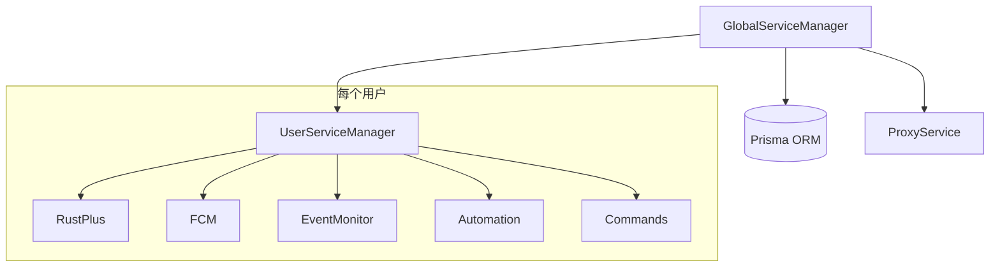

# GlobalServiceManager 模块文档

> 文件: `backend/src/services/global-manager.service.js`
> 行数: 527 | 类型: 单例服务

---

## 1. 概述

`GlobalServiceManager` 是系统的**全局服务编排器**，负责管理所有用户的 `UserServiceManager` 实例。它是多租户 SaaS 架构的核心枢纽，实现用户服务的生命周期管理和事件转发。

---

## 2. 核心职责

| 职责 | 描述 |
|------|------|
| **用户服务管理** | 创建、获取、删除用户服务实例（Map\<userId, UserServiceManager\>） |
| **订阅检查** | 每小时检查过期订阅，自动清理服务 |
| **事件转发** | 将用户服务事件转发到 WebSocket 层 |
| **代理同步** | 刷新所有用户的代理配置 |

---

## 3. 类结构

```javascript
class GlobalServiceManager extends EventEmitter {
  constructor() {
    this.userServices = new Map();         // 用户服务实例
    this.subscriptionCheckTimer = null;    // 订阅检查定时器
    this.CHECK_INTERVAL = 60 * 60 * 1000;  // 检查间隔（1小时）
  }
}

export default new GlobalServiceManager(); // 单例导出
```

---

## 4. 公开方法

### 4.1 初始化

| 方法 | 参数 | 返回值 | 描述 |
|------|------|--------|------|
| `initializeAllActiveUsers()` | 无 | `Promise<{success, failed}>` | 启动时初始化所有有效用户服务 |

**流程**:
1. 查询所有 `isActive=true` 且订阅未过期的用户
2. 为每个用户调用 `createUserService()`
3. 启动订阅检查定时器

---

### 4.2 用户服务管理

| 方法 | 参数 | 描述 |
|------|------|------|
| `createUserService(userId)` | userId: string | 创建用户服务实例 |
| `removeUserService(userId, reason)` | userId: string, reason: string | 删除用户服务实例 |
| `getUserService(userId)` | userId: string | 获取用户服务实例 |
| `getActiveUserIds()` | 无 | 获取所有活跃用户 ID |
| `getActiveUserCount()` | 无 | 获取活跃用户数量 |

---

### 4.3 订阅检查

| 方法 | 描述 |
|------|------|
| `startSubscriptionCheck()` | 启动定时器（每小时） |
| `stopSubscriptionCheck()` | 停止定时器 |
| `checkExpiredSubscriptions()` | 立即检查过期订阅 |

**检查逻辑**:
- 遍历所有活跃用户
- 用户无效/订阅过期 → 删除服务
- 剩余 ≤3 天 → 发出 `subscriptions:expiring:soon` 事件

---

### 4.4 其他

| 方法 | 描述 |
|------|------|
| `shutdownAll()` | 停止所有用户服务（应用关闭时调用） |
| `refreshAllUserProxySettings()` | 全局代理配置变更时同步到所有用户 |

---

## 5. 事件转发

`GlobalServiceManager` 监听并转发以下事件类别：

| 类别 | 事件 |
|------|------|
| **服务器** | `server:connected`, `server:disconnected`, `server:error`, `server:reconnecting` |
| **队伍** | `team:message`, `team:changed` |
| **设备** | `entity:changed`, `alarm:triggered` |
| **摄像头** | `camera:subscribing`, `camera:subscribed`, `camera:render` |
| **FCM** | `server:paired`, `entity:paired`, `fcm:listening`, `fcm:stopped`, `fcm:error` |
| **事件监控** | `cargo:spawn`, `heli:spawn`, `player:died`, `player:online`, `player:offline` |
| **自动化** | `automation:executed` |

---

## 6. 依赖关系



---

## 7. 使用示例

```javascript
import globalServiceManager from './services/global-manager.service.js';

// 获取用户服务
const userService = globalServiceManager.getUserService(userId);

// 监听事件
globalServiceManager.on('server:connected', (data) => {
  console.log('服务器已连接:', data);
});

// 创建新用户服务
await globalServiceManager.createUserService(newUserId);

// 获取活跃用户数
const count = globalServiceManager.getActiveUserCount();
```
