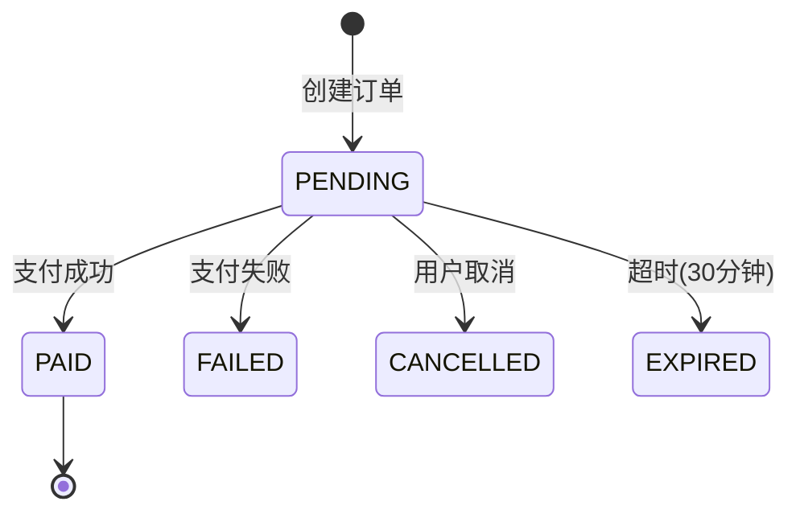

# PaymentService 模块文档

> 文件: `backend/src/services/payment.service.js`
> 行数: 380 | 类型: 单例服务

---

## 1. 概述

`PaymentService` 是 **订单管理服务**，负责创建订单、查询订单、处理支付回调、延长用户订阅时间。

---

## 2. 套餐配置

### 价格
| 套餐 | 价格 |
|------|------|
| 月付 (MONTHLY) | ¥19.9 |
| 季付 (QUARTERLY) | ¥49.9 |
| 年付 (YEARLY) | ¥149.9 |

### 时长
| 套餐 | 天数 |
|------|------|
| 试用 (TRIAL) | 7 天 |
| 月付 | 30 天 |
| 季付 | 90 天 |
| 年付 | 365 天 |

---

## 3. 公开方法

| 方法 | 描述 |
|------|------|
| `createOrder(userId, planType, paymentMethod)` | 创建订单 |
| `getUserOrders(userId, options)` | 获取用户订单 |
| `getOrderById(orderId)` | 根据 ID 获取订单 |
| `getOrderByTradeNo(tradeNo)` | 根据交易号获取 |
| `updateOrder(orderId, updates)` | 更新订单 |
| `markOrderAsPaid(orderId, tradeNo)` | 标记已支付 |
| `markOrderAsFailed(orderId, reason)` | 标记失败 |
| `cancelOrder(orderId, userId)` | 取消订单 |
| `cleanExpiredOrders()` | 清理过期订单 |
| `getPlanPrices()` | 获取价格配置 |
| `getPlanDurations()` | 获取时长配置 |

---

## 4. 订单状态流转

