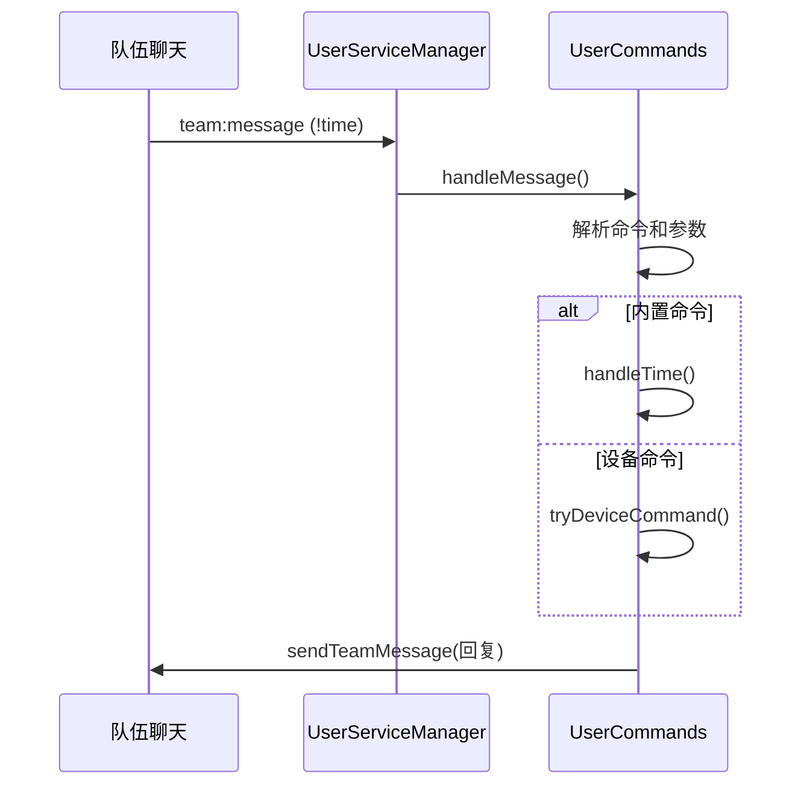

# UserCommands 模块文档

> 文件: `backend/src/services/user-commands.js`
> 行数: 720 | 类型: 用户实例服务

---

## 1. 概述

`UserCommands` 是用户级别的 **游戏内命令服务**，处理队伍聊天中的 `!` 命令，包括内置命令和自定义设备命令。

---

## 2. 内置命令

| 命令 | 处理方法 | 功能 |
|------|----------|------|
| `!help` | `handleHelp()` | 显示帮助 |
| `!time` | `handleTime()` | 游戏时间 + 日夜倒计时 |
| `!pop` | `handlePop()` | 服务器在线人数 |
| `!team` | `handleTeam()` | 队伍统计 |
| `!online` | `handleOnline()` | 在线队友列表 |
| `!afk` | `handleAfk()` | 挂机队友列表 |
| `!cargo` | `handleCargo()` | 货船状态 |
| `!heli` | `handleHeli()` | 直升机状态 |
| `!small` | `handleSmallOilRig()` | 小油井状态 |
| `!large` | `handleLargeOilRig()` | 大油井状态 |

---

## 3. 自定义设备命令

用户可为设备绑定自定义命令：

```
!灯          # 切换开关状态
!门 on       # 手动开启
!门 off      # 手动关闭
!灯 on 5m    # 开启后 5 分钟自动关闭
```

---

## 4. 公开方法

| 方法 | 描述 |
|------|------|
| `handleMessage(serverId, name, steamId, message)` | 处理消息入口 |
| `registerCommand(name, config)` | 注册自定义命令 |
| `tryDeviceCommand(serverId, commandName, args, context)` | 尝试执行设备命令 |
| `getDeviceCommands(serverId)` | 获取设备命令（带缓存） |

---

## 5. 命令处理流程



---

## 6. 使用示例

```javascript
const commands = new UserCommands(userId, rustPlusService, eventMonitor);

// 处理消息
await commands.handleMessage(serverId, '玩家名', 'steamId', '!time');

// 注册自定义命令
commands.registerCommand('自定义', {
  handler: async (serverId, args, context) => {
    // 处理逻辑
  }
});
```
