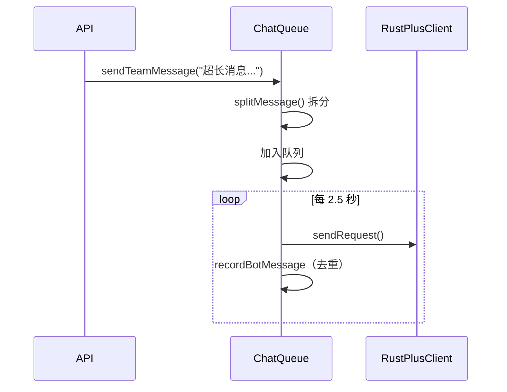

# UserRustPlusManager 模块文档

> 文件: `backend/src/services/user-rustplus-manager.js`
> 行数: 977 | 类型: 用户实例服务

---

## 1. 概述

`UserRustPlusManager` 是用户级别的 **Rust+ 连接管理器**，负责管理该用户的所有 Rust+ 服务器 WebSocket 连接。支持自动重连、消息队列、地图缓存和摄像头订阅。

---

## 2. 核心职责

| 职责 | 描述 |
|------|------|
| **连接管理** | 连接/断开/自动重连服务器 |
| **消息队列** | 队伍聊天消息拆分和速率限制 |
| **地图缓存** | 缓存地图大小和 oceanMargin |
| **设备控制** | 控制智能开关/警报 |
| **摄像头** | CCTV 摄像头订阅和控制 |

---

## 3. 类结构

```javascript
class UserRustPlusManager extends EventEmitter {
  constructor(userId) {
    this.userId = userId;
    this.connections = new Map();      // serverId -> RustPlusClient
    this.connecting = new Set();       // 正在连接的服务器（竞态保护）
    this.serverConfigs = new Map();    // 配置备份（用于重连）
    this.reconnectAttempts = new Map();
    this.reconnectTimers = new Map();
    this.manualDisconnect = new Set(); // 手动断开（不自动重连）
    this.cameras = new Map();          // 摄像头实例
    this.mapCache = new Map();         // 地图缓存
    this.chatQueues = new Map();       // 消息队列
    
    // 配置
    this.CHAT_MAX_LENGTH = 128;        // Rust+ 消息长度限制
    this.CHAT_SEND_DELAY = 2500;       // 消息发送间隔
  }
}
```

---

## 4. 公开方法

### 4.1 连接管理

| 方法 | 参数 | 描述 |
|------|------|------|
| `connect(config)` | `{serverId, ip, port, playerId, playerToken}` | 连接到服务器 |
| `disconnect(serverId)` | serverId | 断开连接（手动，不自动重连） |
| `disconnectAll()` | - | 断开所有连接 |
| `isConnected(serverId)` | serverId | 检查是否已连接 |
| `getConnectedServers()` | - | 获取已连接服务器列表 |

### 4.2 信息查询

| 方法 | 描述 |
|------|------|
| `getServerInfo(serverId)` | 获取服务器信息 |
| `getTeamInfo(serverId)` | 获取队伍信息 |
| `getTeamChat(serverId)` | 获取聊天历史 |
| `getTime(serverId)` | 获取游戏时间 |
| `getMap(serverId)` | 获取地图数据 |
| `getMapMarkers(serverId)` | 获取地图标记 |
| `getMapSize(serverId)` | 获取地图大小（带缓存） |
| `getMapOceanMargin(serverId)` | 获取海洋边距 |
| `getReliableMapSize(serverId)` | 获取可靠地图大小（同步刷新） |
| `getLiveMapContext(serverId)` | 实时获取 `{mapSize, oceanMargin}` |

### 4.3 消息发送

| 方法 | 描述 |
|------|------|
| `sendTeamMessage(serverId, message, options)` | 发送队伍消息（自动拆分+队列） |
| `splitMessage(message)` | 拆分长消息 |
| `isBotMessage(serverId, message)` | 检查是否 bot 消息（去重） |

### 4.4 设备控制

| 方法 | 描述 |
|------|------|
| `setEntityValue(serverId, entityId, value)` | 设置设备值 |
| `turnSmartSwitchOn(serverId, entityId)` | 打开开关 |
| `turnSmartSwitchOff(serverId, entityId)` | 关闭开关 |
| `getEntityInfo(serverId, entityId)` | 获取设备状态 |
| `promoteToLeader(serverId, steamId)` | 移交队长权限 |

### 4.5 摄像头

| 方法 | 描述 |
|------|------|
| `subscribeCamera(serverId, cameraId)` | 订阅摄像头 |
| `unsubscribeCamera(serverId, cameraId)` | 取消订阅 |
| `cameraMove(serverId, cameraId, buttons, x, y)` | 移动摄像头 |
| `cameraZoom(serverId, cameraId)` | 缩放 |
| `cameraShoot(serverId, cameraId)` | 拍照 |

---

## 5. 自动重连机制

```
前5次：5s → 10s → 20s → 40s → 60s（递增延迟）
之后：每 60s 无限重试
```

- 手动 `disconnect()` 不会触发自动重连
- `manualDisconnect` Set 跟踪手动断开的服务器

---

## 6. 消息队列机制



- 每条消息最多 128 字符
- 发送间隔 2.5 秒
- Bot 消息记录用于去重

---

## 7. 事件列表

| 事件 | 触发时机 |
|------|----------|
| `server:connected` | 服务器连接成功 |
| `server:disconnected` | 服务器断开 |
| `server:error` | 服务器错误 |
| `server:reconnecting` | 开始重连 |
| `team:message` | 收到队伍消息 |
| `team:changed` | 队伍变化 |
| `entity:changed` | 设备状态变化 |
| `alarm:triggered` | 警报触发 |
| `camera:*` | 摄像头事件 |

---

## 8. 使用示例

```javascript
const rustPlusManager = new UserRustPlusManager(userId);

// 设置代理（可选）
rustPlusManager.setProxyConfig({ host: '127.0.0.1', port: 10808 });

// 连接服务器
await rustPlusManager.connect({
  serverId: 'xxx',
  ip: '1.2.3.4',
  port: '28015',
  playerId: 'steamId',
  playerToken: 'token'
});

// 发送消息
await rustPlusManager.sendTeamMessage('xxx', '你好世界', { isBot: true });

// 控制设备
await rustPlusManager.turnSmartSwitchOn('xxx', 12345);

// 获取地图大小
const mapSize = await rustPlusManager.getReliableMapSize('xxx');
```
