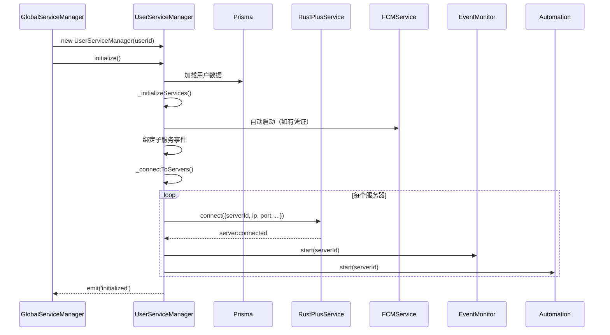
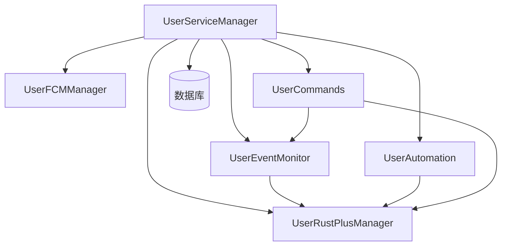

# UserServiceManager 模块文档

> 文件: `backend/src/services/user-service-manager.js`
> 行数: 791 | 类型: 用户实例服务

---

## 1. 概述

`UserServiceManager` 是**每用户独立实例**的服务管理器，负责编排和协调该用户的所有子服务。它是多租户架构的用户层核心，管理 Rust+、FCM、事件监控、自动化和命令系统。

---

## 2. 核心职责

| 职责 | 描述 |
|------|------|
| **子服务编排** | 管理 5 个子服务的生命周期 |
| **事件转发** | 将子服务事件转发到 GlobalServiceManager |
| **配对处理** | 处理服务器和设备配对事件 |
| **日志记录** | 黑匣子日志缓冲区（最多 200 条） |

---

## 3. 类结构

```javascript
class UserServiceManager extends EventEmitter {
  constructor(userId) {
    this.userId = userId;
    this.isInitialized = false;
    this.isShuttingDown = false;
    this.user = null;
    this.logs = [];           // 黑匣子日志
    this.MAX_LOGS = 200;
    
    // 5 个子服务实例
    this.rustPlusService;      // Rust+ 连接管理
    this.fcmService;           // FCM 推送监听
    this.eventMonitorService;  // 事件监控
    this.automationService;    // 设备自动化
    this.commandsService;      // 游戏内命令
  }
}
```

---

## 4. 子服务列表

| 服务 | 实例名 | 功能 |
|------|--------|------|
| UserRustPlusManager | `rustPlusService` | 管理 Rust+ WebSocket 连接 |
| UserFCMManager | `fcmService` | 监听 FCM 推送消息 |
| UserEventMonitor | `eventMonitorService` | 追踪游戏事件 |
| UserAutomation | `automationService` | 设备自动化控制 |
| UserCommands | `commandsService` | 处理 `!` 命令 |

---

## 5. 公开方法

### 5.1 生命周期

| 方法 | 描述 |
|------|------|
| `initialize()` | 初始化用户服务（加载数据、启动子服务、连接服务器） |
| `shutdown()` | 停止用户服务（断开连接、停止子服务） |

### 5.2 信息查询

| 方法 | 返回值 | 描述 |
|------|--------|------|
| `getUserInfo()` | `{id, username, email, isActive, subscriptions}` | 获取用户信息 |
| `getStatus()` | `{userId, isInitialized, services, logs, ...}` | 获取服务状态（含日志） |
| `log(module, message, level)` | void | 记录日志到黑匣子 |

---

## 6. 初始化流程



---

## 7. 事件转发

UserServiceManager 监听并转发以下事件：

| 来源 | 事件 |
|------|------|
| **RustPlus** | `server:*`, `team:message`, `entity:changed`, `alarm:triggered`, `camera:*` |
| **FCM** | `server:paired`, `entity:paired`, `fcm:listening/stopped/error` |
| **EventMonitor** | `cargo:*`, `heli:*`, `player:died/online/offline/afk` |
| **Automation** | `automation:executed` |

---

## 8. 配对处理

### 8.1 服务器配对 (`_handleServerPairing`)
1. 保存/更新服务器到数据库
2. 重新加载用户数据
3. 断开旧连接（如存在）
4. 发起新连接
5. 启动事件监控和自动化

### 8.2 设备配对 (`_handleEntityPairing`)
1. 确定设备类型（1=Switch, 2=Alarm, 3=Storage）
2. 创建/更新设备记录
3. 发出 `entity:paired:success` 事件

### 8.3 警报处理 (`_handleAlarmTriggered`)
1. 查询设备信息
2. 更新 `lastTrigger` 时间
3. 发送游戏内聊天消息
4. 发出 `alarm:triggered` 事件

---

## 9. 依赖关系



---

## 10. 使用示例

```javascript
// 由 GlobalServiceManager 创建
const userService = new UserServiceManager(userId);
await userService.initialize();

// 获取服务状态
const status = userService.getStatus();
console.log(status.services);      // {rustPlus: true, fcm: true, ...}
console.log(status.logs);          // 黑匣子日志

// 访问子服务
userService.rustPlusService.sendTeamMessage(serverId, '你好');
userService.fcmService.getStatus();

// 关闭服务
await userService.shutdown();
```
